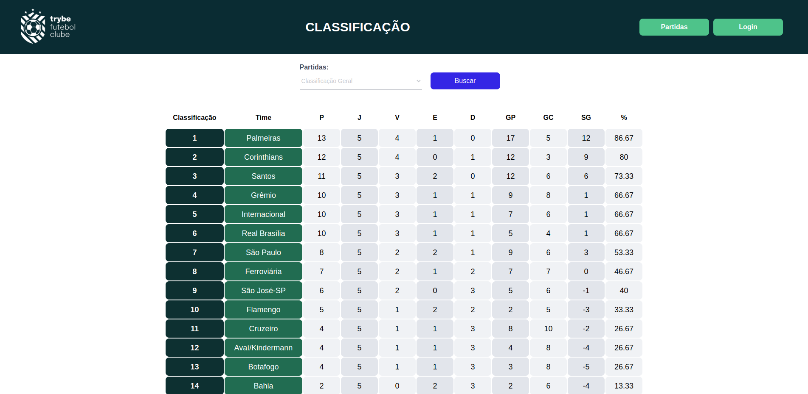

# Trybe Football Club

# Contexto

TFC é um site informativo sobre partidas e classificações de futebol! ⚽️. O objetivo deste desafio é desenvolver uma API utilizando modelagem de dados através do Sequelize para ser consumida pelo front que já está completamente implementado. O acesso aos end-points, segue os princípios REST. Para acessar alguns endereços vinculados a usuário é necessário fazer autenticação e quando autenticado a API responderá trazendo um token no corpo da requisição. O token deverá ser inserido no cabeçalho de cada requisição privada, com o intuito de autenticação.

## preview

 

## Importante:

- E aconselhável o uso de softwares de envio de requisições REST como:
- [Insomia](https://insomnia.rest/)
- [Postman](https://www.postman.com/)
- [Httpie](https://httpie.io/)
